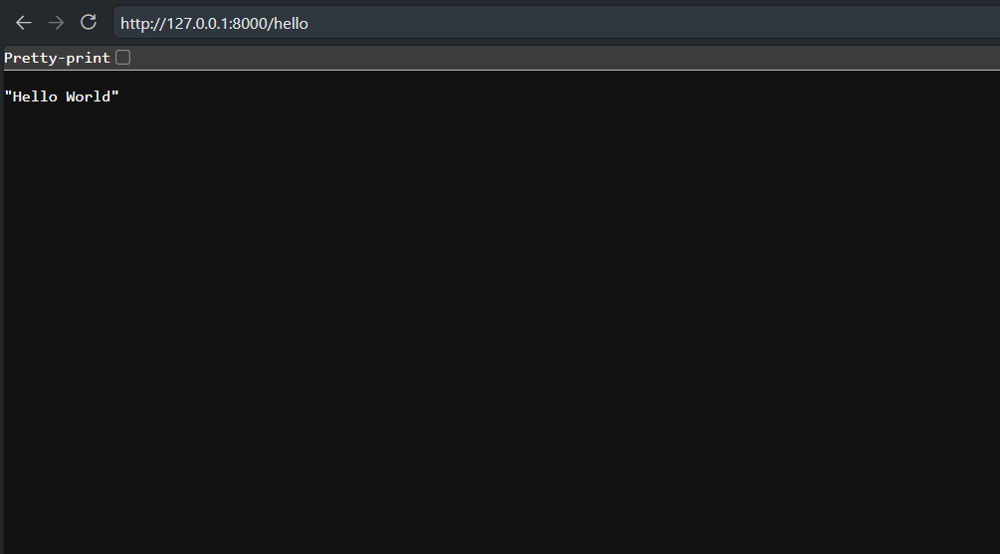
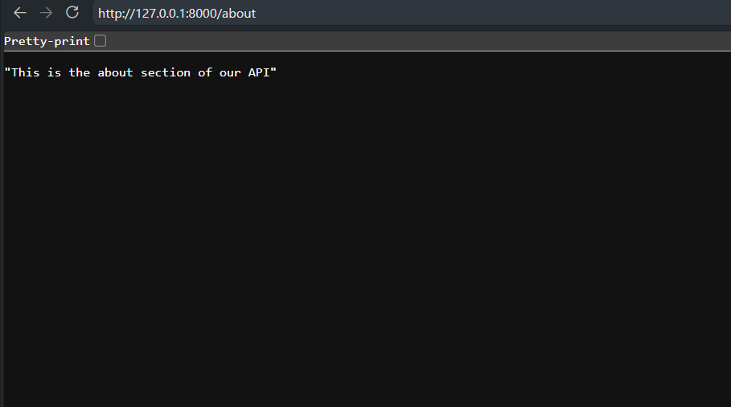
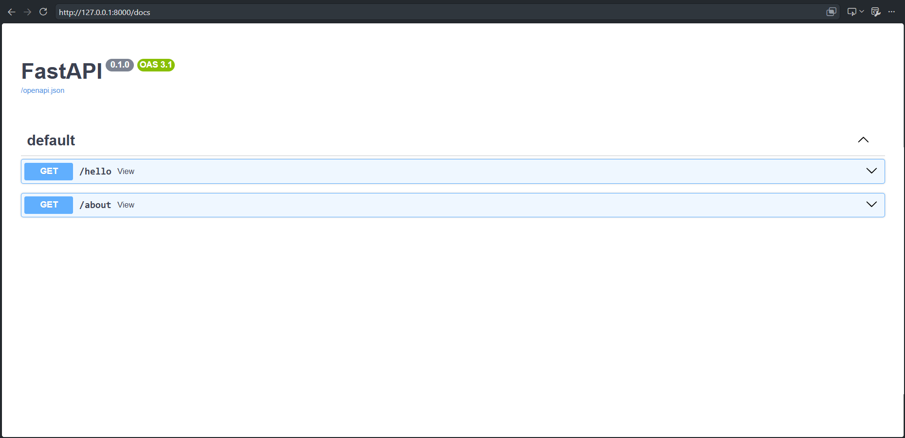

# FastAPI

> Class 1 notes

# API = Application Programming Interface

An API is a set of rules and endpoints that allows one software application to communicate with another.
In a web application, an API usually acts as the communication layer between the frontend and backend.

# Basic Web Application Architecture
```text
    User
     ↓
  Frontend
     ↓
Backend / API
     ↓
  Database
```

# Frontend

The frontend is the part of an application that the user directly interacts with.

- Handles UI and user interaction
- Takes user input, Displays data
- **Sends requests to the backend**
- **Receives responses from the backend**

Examples: React, Next.js, Vue, HTML/CSS/JavaScript, Android, iOS

# Backend

The backend is the server-side part of an application that handles the application's logic and data processing.

- Handles API requests
- Contains business logic
- Validates data
- Handles authentication/authorization
- Communicates with the database
- Sends responses to the frontend

Examples: FastAPI, Django, Node.js/Express, Spring Boot

# Database

A database stores and manages application data persistently.

Examples:

- Relational: PostgreSQL, MySQL, SQLite
- NoSQL: MongoDB, Redis

Example for an Expense Tracker:

    Users
    Expenses
    Categories
    Transactions

# Frontend vs Backend vs Database

    Frontend  → User interface & interaction
    Backend   → Logic & data processing
    Database  → Persistent data storage

# API Communication

Frontend should generally not directly access the database.
```text
    Frontend
       ↓ (Request)
 Backend / API
       ↓
    Database
       ↓
  Backend / API
       ↓ (Response)
    Frontend
```
The backend acts as the middle layer between the client and the database.

# API Endpoint

An endpoint is a specific URL through which a client can interact with a backend.

Examples:

    GET    /expenses
    POST   /expenses
    PUT    /expenses/10
    DELETE /expenses/10

# One Backend, Multiple Clients

The same backend/API can serve different types of clients.
```text
        ┌── Web App
        │
    Client ─┼── Android App
        │
        └── iOS App
              ↓
           Backend
              ↓
           Database
```
# Real-World Example: University Admission System

A university admission website can communicate with an education board's system/database to verify a student's SSC/HSC information.
```text
    Student
       ↓
Admission Website
       ↓
  Backend / API
       ↓
Education Board DB
       ↓
 SSC + HSC Infos
       ↓
    Backend
       ↓
  Eligibility 
       ↓
    Student
```
Example eligibility condition:

>   SSC GPA + HSC GPA > 9

The backend can retrieve/verify the student's GPA and calculate the eligibility.

Example:

    SSC GPA = 4.80
    HSC GPA = 4.50

    Total = 9.30
    9.30 > 9 → Eligible

The eligibility decision should be handled by the backend rather than trusting frontend calculations.

# Real-World Example: Uber

A large application like Uber has multiple types of data and services.

    Uber App
       ↓
    Backend
       ↓
    ├── Users
    ├── Drivers
    ├── Rides
    ├── Locations
    ├── Payments
    ├── Ratings
    └── Notifications

The backend coordinates these different services and data sources.

# Real-World Example: Google Maps

A map application involves more than simply storing map data.
```text
     User (Request)
       ↓
Backend / Service
       ↓
 Location Search
       ↓
Route Calculation
       ↓
distance/time calc
       ↓
Traffic/Other Data
       ↓
    Response
       ↓
  Frontend Map
```
Real-world applications can combine:

    Frontend
    +
    Backend
    +
    Database
    +
    External Services
    +
    Business Logic / Algorithms

# Database ≠ Backend

Database:

>Stores and manages data

Backend:

>   Processes data
>   Applies business logic
>   Validates requests
>   Controls access
>   Communicates with databases/services

# FastAPI

FastAPI is a modern Python web framework for building APIs and backend applications.

Example:

    @app.get("/expenses")
    def get_expenses():
        ...

For the Expense Tracker:
```text
   Users
     ↓
  Frontend
     ↓
  FastAPI
     ↓
  Database
```
# Core Mental Model
```text
    CLIENT
      ↓
   REQUEST
      ↓
API / BACKEND
      ↓
BUSINESS LOGIC
      ↓
DB/EXT. SERVICE
      ↓
   RESPONSE
      ↓
    CLIENT
```

> FastAPI allows us to build APIs and backend applications using Python

# FastAPI Basics — Endpoints

After creating the FastAPI application, endpoints can be created using decorators.

```python
from fastapi import FastAPI

app = FastAPI()

# now we can create endpoints using our api

@app.get("/hello")        # decorator("/url") -> this is the endpoint
def view():
    return "Hello World"

@app.get("/about")        # this is another endpoint
def view():
    return "This is the about section of our API"

# to run in terminal:
# uvicorn filename:appname --reload (auto fetches changes)


# decorator:
# @app.get("/path")       # path is the endpoint
#
#       |-> these are request methods
#       |-> CRUD operations
#       |-> Create, Read, Update, Delete
#       |->       |       |       |
#       |->      Post,    Get,    Put,    Delete


# documentation:
# FastAPI automatically generates documentation for your API endpoints.
#
# You can access the documentation at url/docs
```

# Endpoints

An endpoint is a specific URL/path through which a client can communicate with the API.

Examples:

```text
GET /hello
GET /about
```

In FastAPI, endpoints are defined using decorators such as:

```python
@app.get("/hello")
```

Here:

```text
@app.get() → decorator
"/hello"   → endpoint/path
GET        → HTTP request method
```

# HTTP Request Methods

HTTP methods define what type of operation the client wants to perform.

```text
GET     → Read / retrieve data
POST    → Create data
PUT     → Update data
DELETE  → Delete data
```

These operations are commonly associated with CRUD:

```text
CRUD
│
├── Create → POST
├── Read   → GET
├── Update → PUT
└── Delete → DELETE
```

# FastAPI Automatic Documentation

FastAPI automatically generates interactive API documentation.

Swagger UI is available at:

```text
http://127.0.0.1:8000/docs
```

The documentation automatically detects the endpoints defined in the application.

# API Response Examples

### `/hello`

```text
GET /hello

Response:
"Hello World"
```



### `/about`

```text
GET /about

Response:
"This is the about section of our API"
```



### `/docs`

FastAPI provides an interactive Swagger UI where available API endpoints can be viewed and tested.



# Running the Application

Run the FastAPI application using Uvicorn:

```bash
uvicorn main:app --reload
```

Where:

```text
main → Python file (main.py)
app  → FastAPI application object
--reload → automatically reloads when code changes
```
